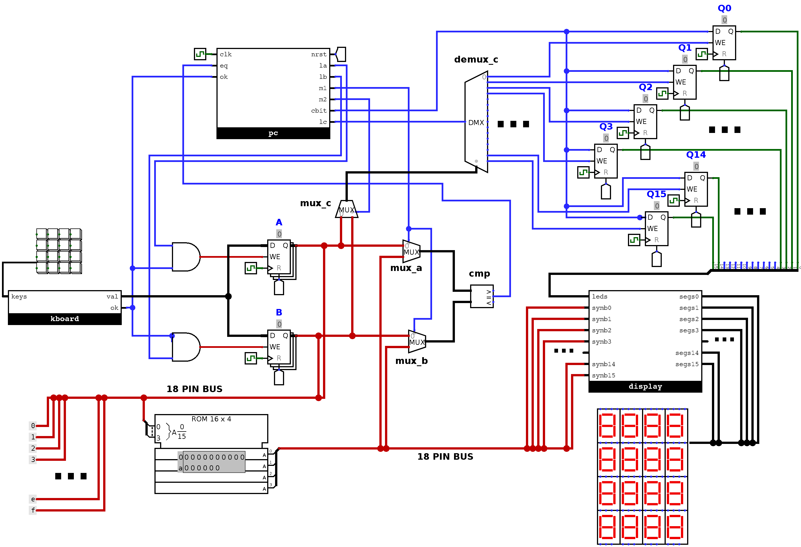

# matchgame

A VHDL processor for a card matching game, written with _mostly_ structural code.
It implements a dedicated algorithm using the "control part + operative part" strategy.



## Dependencies

* make 4.2.1
* ghdl 3.0.0
* GTKWave 3.3.103

## Simulate

There are .gtkw files in the [waves/](waves) folder for ready visualization.

```
make perfect
gtkwave perfect.gtkw
```

```
make mistakes
gtkwave mistakes.gtkw
```
